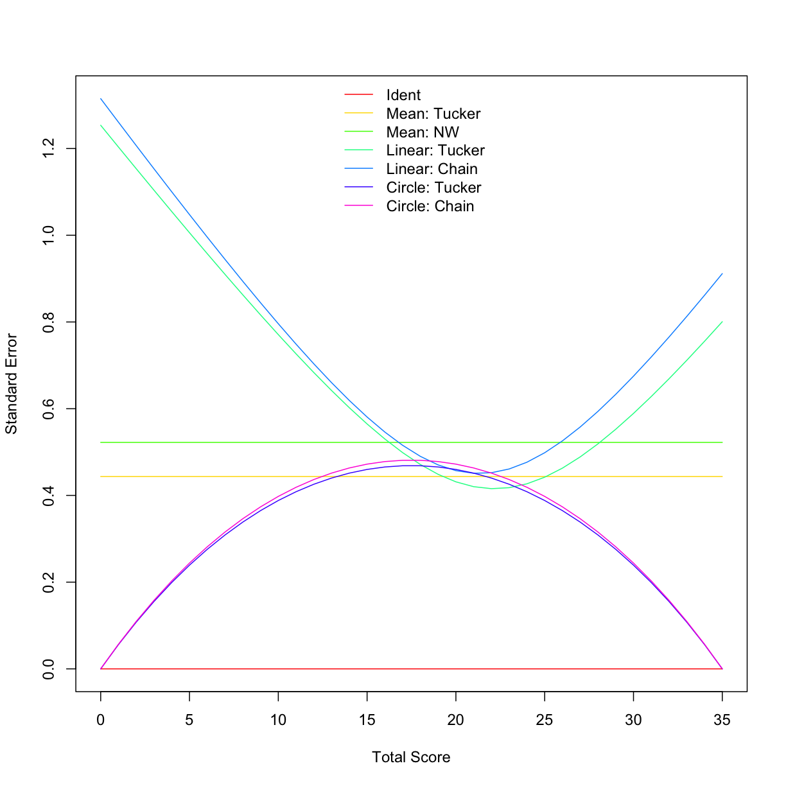
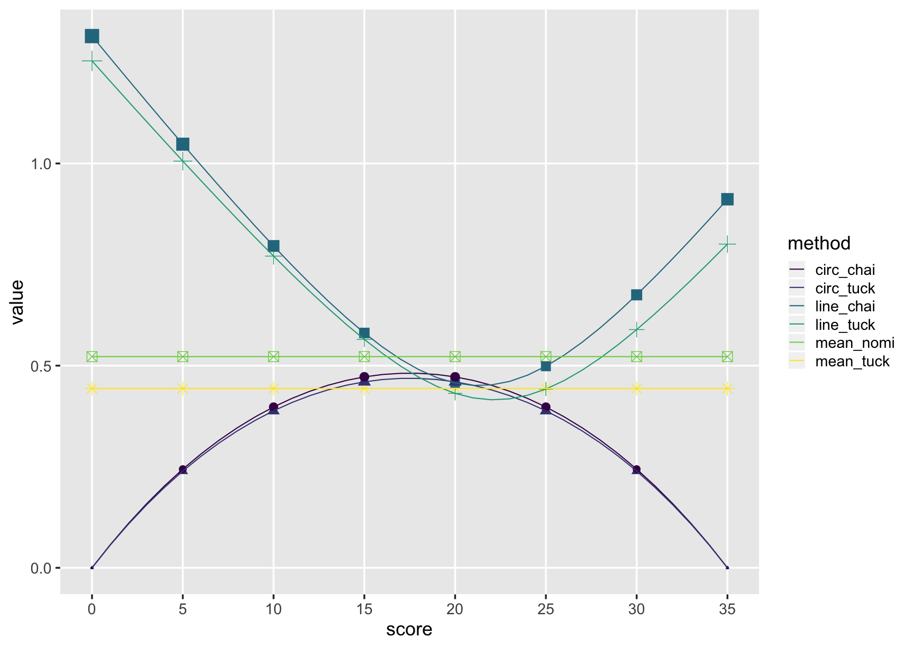

---
# Please do not edit this file directly; it is auto generated.
# Instead, please edit 06-equate.md in _episodes_rmd/
title: "Part 2: Test Equating"
teaching: 60
exercises: 35
questions:
  - "How do I prepare data for test equating?"
  - "How do I conduct test equating?"
  - "How do I extract indices of interest for comparison, reporting, and analysis?"
  - "how do I visualize equated relationships?"
objectives:
   - "Prepare frequency tables of test scores."
   - "Use `equate` to conduct equating studies."
   - "Extract estimates of error for presenting in figures."
keypoints:
   - "`equate` can be used for small- and large-sample test equating."
---

We start by loading the required packages.

~~~
library(tidyverse)
library(equate)
~~~
{: .language-r}

If not still in the workspace, load the data we saved in the previous lesson. We also need to
calculate the raw total and raw anchor scores for the reading and listening tests,

~~~
# load test_1_raw_totals
test_1_raw <- read_csv('data_output/test_1_raw_totals.csv') %>% # read in our total score data from earlier
  select(-country)

# load placement 1 and 2 data
test_results_1 <- read_csv('data/placement_1.csv')

test_results_2 <- read_csv('data/placement_2.csv')

# create total raw and anchor scores
test_2_raw <- test_results_2 %>%
  mutate(raw_total = rowSums(.[5:69], na.rm = TRUE)) %>%
  mutate(read_raw_total = rowSums(select(., contains("_read_")), na.rm = TRUE)) %>%
  mutate(list_raw_total = rowSums(select(., contains("_list_")), na.rm = TRUE)) %>%
  mutate(list_an_raw = rowSums(select(., matches("q\\d+_list_\\w{2,4}_an")), na.rm = TRUE)) %>% # ugly regex for summing listening anchor items
  mutate(read_an_raw = rowSums(select(., matches("q\\d+_read_\\w{2,4}_an")), na.rm = TRUE)) %>%
  select(ID, contains('raw'))

# write_csv(test_2_raw, 'data_output/test_2_raw_totals.csv')
~~~
{: .language-r}

## Preparing the data

The `equate` function requires frequency tables of the test scores that are to be equated. We
are working with data that was collected under the Non-equivalent group anchor test (NEAT) design.
As a result, we need bivariate frequency tables, or frequency tables of score combinations on the 
anchor and total test. The `equate` package has a function named `freqtab` to help us compute these.
We will be using two arguments in this function: `x` and `scales`. We will start with the listening 
test.

One quick way for us to figure our how many items are on the total test and how many are on the 
anchor test is to `select` the columns of the items and then count them:

~~~
listen_1_total_q <- test_results_1 %>%
  select(contains('list'))

listen_1_an_q <- test_results_1 %>%
  select(contains('list')) %>%
  select(contains('an'))

ncol(listen_1_total_q)
~~~
{: .language-r}

~~~
[1] 35
~~~
{: .output}

~~~
ncol(listen_1_an_q)
~~~
{: .language-r}

~~~
[1] 9
~~~
{: .output}

~~~
listen_1_freq <- freqtab(test_1_raw[c('list_raw_total', 'list_an_raw')], scales = list(0:35, 0:9))
~~~
{: .language-r}

> ## Exercise
>
> Figure out the total and anchor scales for the `test_2_raw` data and then create
> a frequency table for it.
>
> > ## Solution
> >
> > 
> > ~~~
> > # How many questions are on the total and anchor forms?
> > listen_2_total_q <- test_results_2 %>%
> >   select(contains('list'))
> > 
> > listen_2_an_q <- test_results_2 %>%
> >   select(contains('list')) %>%
> >   select(contains('an'))
> > 
> > ncol(listen_2_total_q)
> > ~~~
> > {: .language-r}
> > 
> > 
> > 
> > ~~~
> > [1] 30
> > ~~~
> > {: .output}
> > 
> > 
> > 
> > ~~~
> > ncol(listen_2_an_q)
> > ~~~
> > {: .language-r}
> > 
> > 
> > 
> > ~~~
> > [1] 9
> > ~~~
> > {: .output}
> > 
> > 
> > 
> > ~~~
> > # Create the frequency table
> > 
> > listen_2_freq <- freqtab(test_2_raw[c('list_raw_total', 'list_an_raw')], scales = list(0:30, 0:9))
> > ~~~
> > {: .language-r}
> {: .solution}
{: .challenge}

Now that we have the frequency tables, we are ready to equate. There are a number of consderations
in choosing an equating method [Kolen & Brennan's _Test Equating, Scaling, and Linking_](https://www.amazon.com/Test-Equating-Scaling-Linking-Statistics/dp/1493903160)
is a nice resource for those of you who want to take a deep dive into it.

We will use the circle-arc method right now to equate form 1 on to scores from form 2:

~~~
list_ca <- equate(listen_1_freq, listen_2_freq, type = 'circle-arc', lowp = c(0, 0), highp = c(35, 30))
~~~
{: .language-r}

> ## Exercise
>
> What does a score of 32 on form 1 concord to on form 2?
> (hint: `str` or `glimpse`)
>
> > ## Solution
> >
> > 
> > ~~~
> > list_ca$concordance
> > ~~~
> > {: .language-r}
> > 
> > 
> > 
> > ~~~
> >    scale         yx
> > 1      0  0.0000000
> > 2      1  0.3920108
> > 3      2  0.8166926
> > 4      3  1.2729186
> > 5      4  1.7596900
> > 6      5  2.2761212
> > 7      6  2.8214275
> > 8      7  3.3949150
> > 9      8  3.9959714
> > 10     9  4.6240594
> > 11    10  5.2787099
> > 12    11  5.9595173
> > 13    12  6.6661353
> > 14    13  7.3982727
> > 15    14  8.1556914
> > 16    15  8.9382033
> > 17    16  9.7456691
> > 18    17 10.5779963
> > 19    18 11.4351392
> > 20    19 12.3170976
> > 21    20 13.2239176
> > 22    21 14.1556914
> > 23    22 15.1125584
> > 24    23 16.0947067
> > 25    24 17.1023745
> > 26    25 18.1358527
> > 27    26 19.1954879
> > 28    27 20.2816857
> > 29    28 21.3949150
> > 30    29 22.5357132
> > 31    30 23.7046926
> > 32    31 24.9025471
> > 33    32 26.1300615
> > 34    33 27.3881212
> > 35    34 28.6777250
> > 36    35 30.0000000
> > ~~~
> > {: .output}
> {: .solution}
{: .challenge}

There are three types of error associated with equating: random error, systematic error (or bias),
and total error. To calculate the latter two, we would need a criterion, or gold standard, equating
relationship between the two test forms that we could compare our circle-arc methods to. We dont have
that, so we will estimate the standard error by bootstrapping the equating relationship. One way to 
inspect the random error is by plotting it:

~~~
list_ca_see <- bootstrap(list_ca, reps = 100)

list_ca_see$se
~~~
{: .language-r}

~~~
 [1] 3.657220e-15 1.001322e-01 1.909599e-01 2.733005e-01 3.478435e-01
 [6] 4.151737e-01 4.757893e-01 5.301156e-01 5.785160e-01 6.213010e-01
[11] 6.587346e-01 6.910403e-01 7.184054e-01 7.409848e-01 7.589036e-01
[16] 7.722594e-01 7.811239e-01 7.855445e-01 7.855445e-01 7.811239e-01
[21] 7.722594e-01 7.589036e-01 7.409848e-01 7.184054e-01 6.910403e-01
[26] 6.587346e-01 6.213010e-01 5.785160e-01 5.301156e-01 4.757893e-01
[31] 4.151737e-01 3.478435e-01 2.733005e-01 1.909599e-01 1.001322e-01
[36] 3.658788e-15
~~~
{: .output}

~~~
plot(list_ca_see, out = 'se')
~~~
{: .language-r}

Usually, in carrying out a full equating study, multiple equating relationships are estimated and compared. Below is a demonstration of how this can be done in a few lines of code.

~~~
neat_args <- list(identity = list(type = "identity"),
                  mean_tuck = list(type = "mean", method = "tucker"),
                  mean_nomi = list(type = "mean", method = "nominal weights"),
                  line_tuck = list(type = "linear", method = "tucker"),
                  line_chai = list(type = "linear", method = "chained"),
                  circ_tuck = list(type = "circle-arc", method = "tucker"),
                  circ_chai = list(type = "circle-arc", method = "chained", chainmidp = "linear"))

comp_meth <- bootstrap(x = listen_1_freq, y = listen_2_freq, reps = 100, args = neat_args)

plot(comp_meth, out = "se", addident = FALSE, legendplace = 'top')
~~~
{: .language-r}

~~~
round(summary(comp_meth), 2)
~~~
{: .language-r}

~~~
            se se_w
identity  0.00 0.00
mean_tuck 0.43 0.43
mean_nomi 0.52 0.52
line_tuck 0.75 0.53
line_chai 0.83 0.59
circ_tuck 0.33 0.40
circ_chai 0.34 0.41
~~~
{: .output}

~~~
# using ggplot and dplyr/tidyr

fiver <- comp_meth$se %>%
  as_tibble() %>%
  select(-identity) %>%
  mutate(score = 0:35) %>%
  slice(seq(1, 36, by = 5)) %>%
  gather(key = method, value, -score)

comp_plot <- comp_meth$se %>%
  as_tibble() %>%
  select(-identity) %>%
  mutate(score = 0:35) %>%
  gather(key = method, value, -score) %>%
  ggplot(., aes(x = score, y = value, colour = method, shape = method)) +
  geom_point(data = fiver, aes(size = value), show.legend = FALSE) +
  geom_line() +
  theme_gray(base_size = 18) +
  scale_colour_viridis_d() +
  scale_x_continuous(breaks = c(0, 5, 10, 15, 20, 25, 30, 35), limits = c(0, 35)) +
  theme(panel.grid.minor = element_blank())

comp_plot
~~~
{: .language-r}

~~~
comp_table <- comp_meth$se %>%
  as_tibble() %>%
  summarise_all(., 'mean') %>%
  mutate_all(., 'round', 2)

comp_table
~~~
{: .language-r}

~~~
# A tibble: 1 x 7
  identity mean_tuck mean_nomi line_tuck line_chai circ_tuck circ_chai
     <dbl>     <dbl>     <dbl>     <dbl>     <dbl>     <dbl>     <dbl>
1        0      0.43      0.52      0.71      0.78       0.3      0.31
~~~
{: .output}


