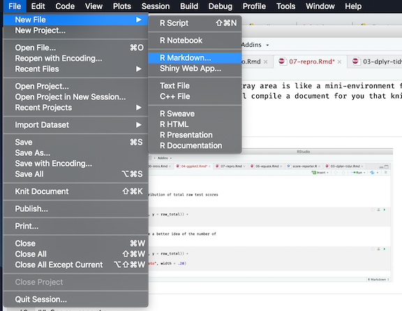
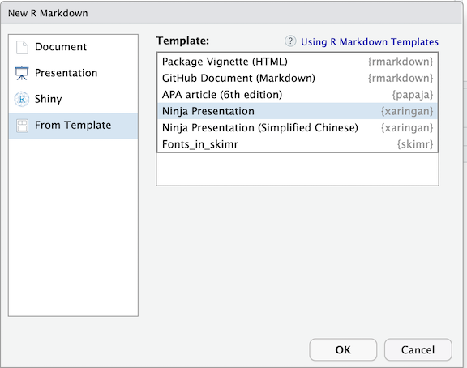

---
# Please do not edit this file directly; it is auto generated.
# Instead, please edit 07-repro.md in _episodes_rmd/
title: "Part 3: Reproducible Reporting"
teaching: 60
exercises: 35
questions:
  - "How do I automate score reporting?"
  - "How do I combine my analysis and reporting?"
objectives:
   - "Write a command that will print score reports for your test takers."
   - "Create a presentation that includes code, prose, and results."
keypoints:
   - "R and RStudio can be used to carry out reproducible test analyses and reporting."
---


The purpose of this part of the workshop is to illustrate how R and RStudio can be leveraged to create a reproducible pipeline for analysis and reporting. Some of the parts in this section move beyond analysis. We will spend just enough time with them to grasp the basics.

There are quite a few R packages that have been created to promote reproducible research. Some of these packages are tools for
accessing databases, some are tools for managing projects, and others are tools for creating reproducible reports. A couple of groups, RStudio and ROpenSci, and people affiliated (officially and unofficially) with them have led the way in this. Today, the main packages that we will be using to learn about this are `knitr`, `rmarkdown`, `tinytex`, and `xaringan`. `knitr` is an ["engine for dynamic report generation with R"](https://yihui.name/knitr/), `rmarkdown` is a ["file format for making dynamic documents with R"](https://rmarkdown.rstudio.com/articles_intro.html), and `tinytex` is a subset of [packages from a larger distribution](https://yihui.name/tinytex/) of LaTeX. This last package we will use first and only once to install the $\LaTeX$ distribution on your computer. It makes creating PDF documents easier.


~~~
tinytex::install_tinytex()
~~~
{: .language-r}


We will interact with `knitr` primarily through the button in RStudio and through the use of its `kable` function to create tables.


You can think of an rmarkdown file, or an .Rmd, file in the same way you think of a .docx file. A place to do writing. Writing in a .Rmd file differs in that  you can include R code in your writing, and you do not do heavy formatting in the file. Below is an example of R chunks (in grey) embedded in prose (we saw this code and this prose in the lesson on data visualization). The "chunks" start with backticks followed by {r} and they end in three backticks. The chunks can be named, and there are parameters that can be set globally across chunks or specifically for one chunk such as `fig.width` to control the width of figures and `echo` to indicate the printing of code with results or not. The gray area is like a mini-environment for R code. You can write and run R code inside of it. When you click the "knit" button, it will compile a document for you that knits together your prose and the ouputs of your analyses.                                                                                                                       
           


## Score reports

Rmarkdown documents have a third component beyond code and prose: yaml. Yaml stands for _Yaml ain't a markup language_. It is found at the top of the document sandwiched between `---` at the top and `---` at the bottom. This can be used to set parameters for the document and add information such as the title, data, and author (depending on the type of document you are making). You can start a .Rmd through the File menu in Rstudio:



Let's save this file as `example.Rmd` in the documents folder. First we will compile it as is so that we can see how the knit button works. Some example minimal, inline formating that can be done is below. More can be found on [RStudio's Rmarkdown cheatsheet](https://resources.rstudio.com/rstudio-cheatsheets/rmarkdown-2-0-cheat-sheet).

```
# Level 1 Header
## Level 2 Header

- unordered list
- unordered list
  + nesting
  
  
1. ordered list 
2. item 2
   i) sub-item 1
     A. sub-sub-item 1

Markdown table

| Right | Left | Default | Center | 
|------:|:-----|---------|:------:|
| 12|12| 12 | 12|
| 123 | 123 | 123 | 123 |
| 1 | 1 | 1 | 1 |

```

Now, let's make some changes. Let's read in some of our data, make a table, and a plot:


~~~
# read in data
library(tidyverse)

test_results_1 <- here::here("data/placement_1.csv") %>%
  read_csv()

# select read and listen main idea items
test_res_an <- test_results_1 %>%
  select(., contains('list'), contains('read')) %>%
  select(contains('_mi')) %>%
  summarise_all('mean')


# tables by skill

list_diff <- select(test_res_an, contains('_list_')) %>%
  knitr::kable(., digits = 2, caption = 'Listening: Main idea item difficulties')
read_diff <- select(test_res_an, contains('_read_'))%>%
  knitr::kable(., digits = 2, caption = 'Reading: Main idea item difficulties')

list_diff
~~~
{: .language-r}


| q1_list_mi| q10_list_mi| q12_list_mi| q20_list_mi| q23_list_mi| q30_list_mi_an| q31_list_mi_an|
|----------:|-----------:|-----------:|-----------:|-----------:|--------------:|--------------:|
|       0.61|        0.77|        0.62|        0.35|        0.36|            0.7|           0.81|


~~~
list_diff
~~~
{: .language-r}


| q1_list_mi| q10_list_mi| q12_list_mi| q20_list_mi| q23_list_mi| q30_list_mi_an| q31_list_mi_an|
|----------:|-----------:|-----------:|-----------:|-----------:|--------------:|--------------:|
|       0.61|        0.77|        0.62|        0.35|        0.36|            0.7|           0.81|


~~~
# visualize

list_read_mi <- test_res_an %>%
  gather(key, value = Difficulty) %>%
  separate(key, into = c('Question', 'Skill', 'Objective', 'Anchor'), sep = "_", fill = 'right')%>%
  ggplot(., aes(x = Question, y = Difficulty, color = Difficulty)) +
  geom_errorbar(aes(x = Question, ymin = Difficulty, ymax = Difficulty), size = 2) +
  facet_wrap(~ Skill, scales = 'free_x') +
  scale_color_viridis_c()

list_read_mi
~~~
{: .language-r}


In order to generate individual score reports for test takers, we need an R script (.R file) that has reads in the data and does some summarizing prior to the reporting. We also need a .Rmd file that serves as a template for the score reports. Doing the calucations in the R script makes it so these calculations are done once and then used in the reporting code, rather than done for each student (which would happen if they were in the .Rmd). Both can be downloaded using the `download.file` command below. Or you can copy and pase the R code below into an .R file.


~~~
download.file("https://raw.githubusercontent.com/gtlaflair/ltrc-2019/gh-pages/_episodes_rmd/documents/score-report-template.Rmd",
              "documents/score-report-template.Rmd", mode = "wb")
~~~
{: .language-r}


~~~
download.file("https://raw.githubusercontent.com/gtlaflair/ltrc-2019/gh-pages/_episodes_rmd/scripts/score-reporter.R",
              "scripts/score-reporter.R", mode = "wb")
~~~
{: .language-r}


~~~
#load packages
library(tidyverse)
library(rmarkdown)
library(knitr)

#load data
test_results_2 <- here::here('data/placement_2.csv') %>%
  read_csv(.)

#compute total and part scores
test_results_2 <- test_results_2 %>%
  mutate(total = rowSums(.[5:69], na.rm = TRUE),
         list_total = rowSums(select(., contains('_list_')), na.rm = TRUE),
         read_total = rowSums(select(., contains('_read_')), na.rm = TRUE))

#compute mean, save these values
total_mean <- mean(test_results_2$total, na.rm = TRUE)
list_mean <- mean(test_results_2$list_total, na.rm = TRUE)
read_mean <- mean(test_results_2$read_total, na.rm = TRUE)


# select a subset so that we do not waste time making 100 score reports today
test_results_rep <- slice(test_results_2, 1:5)

for (i in unique(test_results_rep$ID)){
  student <- test_results_rep %>% filter(ID == i)
  doc_path <- here::here('documents/')
  here::here('documents/score-report-template.Rmd') %>%
  rmarkdown::render(., output_file = paste0(doc_path, 'Score_Report_', as.character(student$names),'.pdf'))
}
~~~
{: .language-r}

## Presentations

There are quite a few frameworks for creating presentations in R (ioslides, Rpres, beamer). One of the more developed and supported (with documentation and in the user community) is [xaringan](https://github.com/yihui/xaringan). This package is hosted on GitHub rather than the official R repository, CRAN. You can install the package by copying or typing the `devtools::install_github('yihue/xaringan')`. An easy way to start building a presentation using this platform is also through the dropdown menu. However, instead of selecting an option from the Document group, you will select "From Template" then "Ninja Presentation".




The beauty of Rmarkdown and these code chunks is that you can use them in different document types. So if we copy our code from above into a xaringan file, we can easily make the same tables and plots in the presentation. Often, I will do all of the coding in a .R file, read that file in at the top of my presentation or paper, and call on the objects I want to print.


