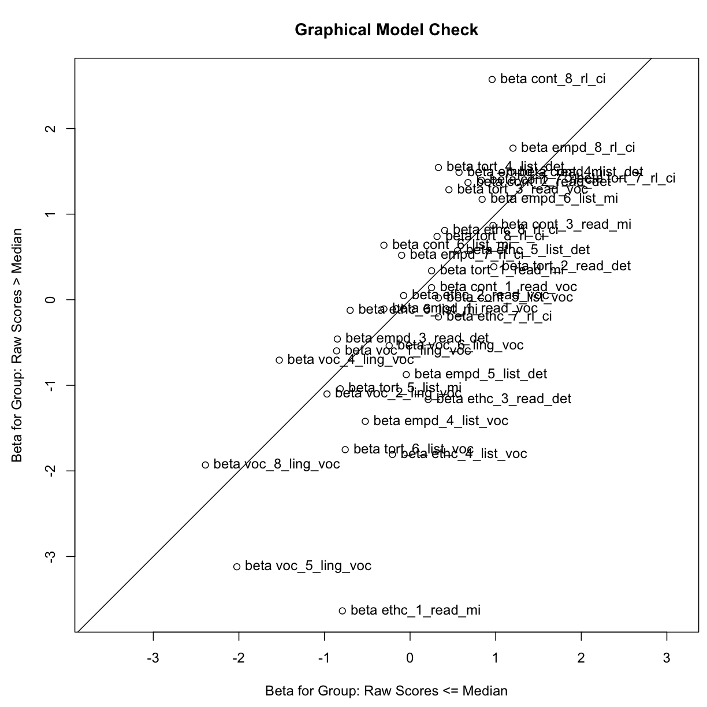
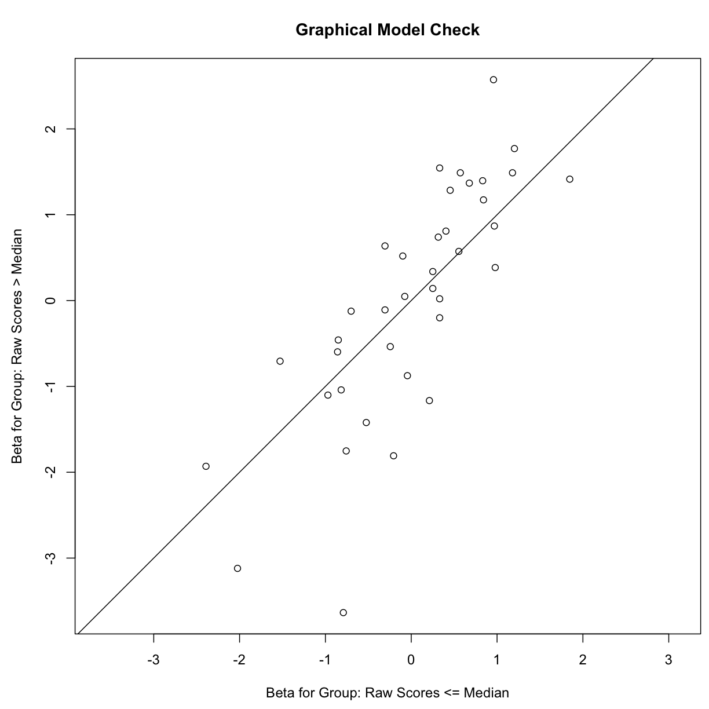
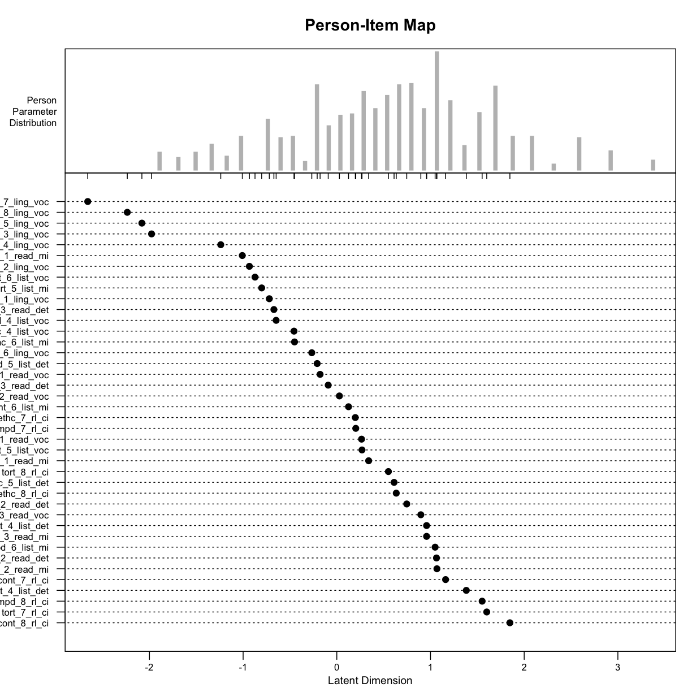
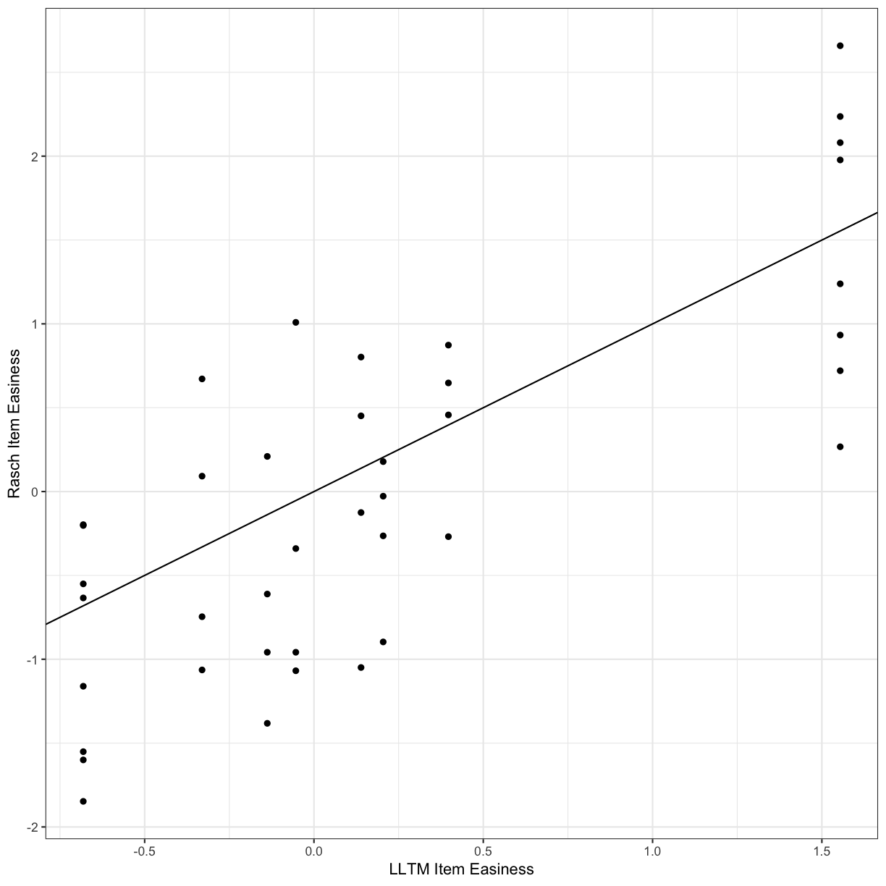

---
# Please do not edit this file directly; it is auto generated.
# Instead, please edit 09-item-resp.md in _episodes_rmd/
title: "Part 5: Item Respose Modeling"
teaching: 60
exercises: 35
questions:
  - "Can I do item response modeling in R?"
objectives:
  - "Carry out Rasch item response modeling"
  - "Carry out linear logistic item response modeling"
  - "Estimate and extract person and item parameters from both model types"
  - "Estimate and extract person and item fit parameters from both model types"
  - "Compare models"
keypoints:
  - "You can do item response modeling in R!"
source: Rmd
---

In this part, we will use the `eRm` package to do some person ability and item difficulty estimation under the Rasch and linear logistic model. Again, we will be leveraging our data munging skills that we have been practicing in the previous parts. 

The data for this part comes from an EAP/ESP vocabulary, listening, and reading test. The test has five testlets, which can be identified in the variable names:

- `ling`: a vocabulary test
- `cont`: a listening, reading, and vocabulary test with business contracts as the topic
- `empd`: a listening, reading, and vocabulary test with employment discrimination laws as the topic
- `ethc`: a listening, reading, and vocabulary test with business ethics as the topic
- `tort`: a listening, reading, and vocabulary test with tort law as the topic

The objectives can also be identified in the variable names:

- `voc`: vocabulary (discrete item in the `ling` testlet; embedded in the others)
- `mi`: main idea question about the testlets reading or listening passage
- `det`: detail question about the testlets reading or listening passage
- `ci`: a question that required the test takers to connect information between the reading and listening passages

We will start by reading in the data

~~~
#load packages
library(tidyverse)
library(eRm)
library(psych)

#load data
irt_dat <- read_csv("data/integrated.csv")

irt_dat <- irt_dat %>%
  mutate(id = rep(1:length(.[1])))
~~~
{: .language-r}

> ## Exercise
> 
> Create a new dataframe that contains only the items.
>
> > ## Solution
> >
> > 
> > ~~~
> > ## Select items
> > ## 1.
> > irt_items <- select(irt_dat, 5:44)
> > 
> > ## 2.
> > irt_items <- select(irt_dat, (voc_1_ling_voc:tort_8_rl_ci))
> > ~~~
> > {: .language-r}
> {: .solution}
{: .challenge}

## Rasch Model

Estimating the parameters is pretty straighforward once you have data prepared.

~~~
# Rasch Model using eRm (cumulative maximum likelihood estimation)
# Step 1: Estimate item parameters
erm_rasch <- RM(irt_items)

# running summary shows us the estimated item parameters and measures of uncertainty
summary(erm_rasch)
~~~
{: .language-r}

~~~

Results of RM estimation: 

Call:  RM(X = irt_items) 

Conditional log-likelihood: -18818.77 
Number of iterations: 34 
Number of parameters: 39 

Item (Category) Difficulty Parameters (eta): with 0.95 CI:
                Estimate Std. Error lower CI upper CI
voc_2_ling_voc    -0.933      0.081   -1.092   -0.774
voc_3_ling_voc    -1.977      0.110   -2.193   -1.762
voc_4_ling_voc    -1.239      0.088   -1.410   -1.067
voc_5_ling_voc    -2.081      0.114   -2.304   -1.857
voc_6_ling_voc    -0.267      0.072   -0.408   -0.126
voc_7_ling_voc    -2.659      0.142   -2.937   -2.381
voc_8_ling_voc    -2.237      0.120   -2.473   -2.000
cont_1_read_voc    0.264      0.068    0.130    0.398
cont_2_read_det    1.064      0.069    0.928    1.199
cont_3_read_mi     0.958      0.069    0.824    1.093
cont_4_list_det    1.382      0.071    1.242    1.522
cont_5_list_voc    0.269      0.068    0.135    0.403
cont_6_list_mi     0.125      0.069   -0.010    0.260
cont_7_rl_ci       1.161      0.070    1.025    1.297
cont_8_rl_ci       1.847      0.077    1.696    1.998
empd_1_read_voc   -0.179      0.071   -0.318   -0.039
empd_2_read_mi     1.069      0.069    0.933    1.204
empd_3_read_det   -0.672      0.077   -0.822   -0.521
empd_4_list_voc   -0.648      0.077   -0.798   -0.498
empd_5_list_det   -0.210      0.071   -0.349   -0.070
empd_6_list_mi     1.049      0.069    0.914    1.184
empd_7_rl_ci       0.202      0.069    0.068    0.337
empd_8_rl_ci       1.551      0.073    1.408    1.694
ethc_1_read_mi    -1.009      0.083   -1.171   -0.847
ethc_2_read_voc    0.028      0.070   -0.109    0.164
ethc_3_read_det   -0.092      0.070   -0.230    0.046
ethc_4_list_voc   -0.457      0.074   -0.602   -0.312
ethc_5_list_det    0.611      0.068    0.478    0.744
ethc_6_list_mi    -0.451      0.074   -0.596   -0.307
ethc_7_rl_ci       0.197      0.069    0.063    0.332
ethc_8_rl_ci       0.634      0.068    0.502    0.767
tort_1_read_mi     0.340      0.068    0.206    0.473
tort_2_read_det    0.746      0.068    0.613    0.879
tort_3_read_voc    0.897      0.068    0.763    1.031
tort_4_list_det    0.958      0.069    0.824    1.093
tort_5_list_mi    -0.802      0.079   -0.957   -0.647
tort_6_list_voc   -0.873      0.080   -1.030   -0.716
tort_7_rl_ci       1.600      0.074    1.456    1.745
tort_8_rl_ci       0.551      0.068    0.418    0.683

Item Easiness Parameters (beta) with 0.95 CI:
                     Estimate Std. Error lower CI upper CI
beta voc_1_ling_voc     0.721      0.078    0.568    0.873
beta voc_2_ling_voc     0.933      0.081    0.774    1.092
beta voc_3_ling_voc     1.977      0.110    1.762    2.193
beta voc_4_ling_voc     1.239      0.088    1.067    1.410
beta voc_5_ling_voc     2.081      0.114    1.857    2.304
beta voc_6_ling_voc     0.267      0.072    0.126    0.408
beta voc_7_ling_voc     2.659      0.142    2.381    2.937
beta voc_8_ling_voc     2.237      0.120    2.000    2.473
beta cont_1_read_voc   -0.264      0.068   -0.398   -0.130
beta cont_2_read_det   -1.064      0.069   -1.199   -0.928
beta cont_3_read_mi    -0.958      0.069   -1.093   -0.824
beta cont_4_list_det   -1.382      0.071   -1.522   -1.242
beta cont_5_list_voc   -0.269      0.068   -0.403   -0.135
beta cont_6_list_mi    -0.125      0.069   -0.260    0.010
beta cont_7_rl_ci      -1.161      0.070   -1.297   -1.025
beta cont_8_rl_ci      -1.847      0.077   -1.998   -1.696
beta empd_1_read_voc    0.179      0.071    0.039    0.318
beta empd_2_read_mi    -1.069      0.069   -1.204   -0.933
beta empd_3_read_det    0.672      0.077    0.521    0.822
beta empd_4_list_voc    0.648      0.077    0.498    0.798
beta empd_5_list_det    0.210      0.071    0.070    0.349
beta empd_6_list_mi    -1.049      0.069   -1.184   -0.914
beta empd_7_rl_ci      -0.202      0.069   -0.337   -0.068
beta empd_8_rl_ci      -1.551      0.073   -1.694   -1.408
beta ethc_1_read_mi     1.009      0.083    0.847    1.171
beta ethc_2_read_voc   -0.028      0.070   -0.164    0.109
beta ethc_3_read_det    0.092      0.070   -0.046    0.230
beta ethc_4_list_voc    0.457      0.074    0.312    0.602
beta ethc_5_list_det   -0.611      0.068   -0.744   -0.478
beta ethc_6_list_mi     0.451      0.074    0.307    0.596
beta ethc_7_rl_ci      -0.197      0.069   -0.332   -0.063
beta ethc_8_rl_ci      -0.634      0.068   -0.767   -0.502
beta tort_1_read_mi    -0.340      0.068   -0.473   -0.206
beta tort_2_read_det   -0.746      0.068   -0.879   -0.613
beta tort_3_read_voc   -0.897      0.068   -1.031   -0.763
beta tort_4_list_det   -0.958      0.069   -1.093   -0.824
beta tort_5_list_mi     0.802      0.079    0.647    0.957
beta tort_6_list_voc    0.873      0.080    0.716    1.030
beta tort_7_rl_ci      -1.600      0.074   -1.745   -1.456
beta tort_8_rl_ci      -0.551      0.068   -0.683   -0.418
~~~
{: .output}

Now we can estimate the person parameters:

~~~
# Step 2

# Estimate person parameters
rasch_pers_params <- person.parameter(erm_rasch)

# Extracts the person ability estimates in logits
rasch_pers_ability <- coef(rasch_pers_params) 
head(rasch_pers_ability)
~~~
{: .language-r}

~~~
    P1     P2     P3     P4     P5     P6 
1.3627 1.3627 1.2120 1.2120 1.2120 1.2120 
~~~
{: .output}

> ## Exercise
> 
> Explore the object `rasch_pers_params`. Can out extract them withou
> `coef`? (hint: `$`)
>
> > ## Solution
> >
> > 
> > ~~~
> > # 1.
> > head(rasch_pers_params$theta.table$`Person Parameter`)
> > 
> > # 2.
> > head(rasch_pers_params$theta.table['Person Parameter'])
> > ~~~
> > {: .language-r}
> {: .solution}
{: .challenge}

Let's check the reliability and fit of the model:

~~~
# Step 3: Reliability & fit

# Likelihood ratio test
eRm_rasch_LRT <- LRtest(erm_rasch)
~~~
{: .language-r}

~~~
Warning in LRtest.Rm(erm_rasch): 
The following items were excluded due to inappropriate response patterns
within subgroups:
voc_3_ling_voc voc_7_ling_voc

Full and subgroup models are estimated without these items!
~~~
{: .error}

~~~
# Estimate Beta for TTs > and < Median
plotGOF(eRm_rasch_LRT) 
~~~
{: .language-r}

~~~
# Tests Beta diffs for >< Median
Waldtest(erm_rasch) 
~~~
{: .language-r}

~~~
Warning in Waldtest.Rm(erm_rasch): 
The following items were excluded due to inappropriate response patterns
within subgroups:
voc_3_ling_voc voc_7_ling_voc

Subgroup models are estimated without these items!
~~~
{: .error}

~~~

Wald test on item level (z-values):

                     z-statistic p-value
beta voc_1_ling_voc        1.534   0.125
beta voc_2_ling_voc       -0.662   0.508
beta voc_4_ling_voc        4.519   0.000
beta voc_5_ling_voc       -2.409   0.016
beta voc_6_ling_voc       -1.771   0.077
beta voc_8_ling_voc        1.621   0.105
beta cont_1_read_voc      -0.761   0.446
beta cont_2_read_det       5.113   0.000
beta cont_3_read_mi       -0.708   0.479
beta cont_4_list_det       2.158   0.031
beta cont_5_list_voc      -2.100   0.036
beta cont_6_list_mi        6.964   0.000
beta cont_7_rl_ci          4.109   0.000
beta cont_8_rl_ci         10.764   0.000
beta empd_1_read_voc       1.313   0.189
beta empd_2_read_mi        6.826   0.000
beta empd_3_read_det       2.379   0.017
beta empd_4_list_voc      -4.123   0.000
beta empd_5_list_det      -4.581   0.000
beta empd_6_list_mi        2.411   0.016
beta empd_7_rl_ci          4.517   0.000
beta empd_8_rl_ci          3.931   0.000
beta ethc_1_read_mi       -4.973   0.000
beta ethc_2_read_voc       0.847   0.397
beta ethc_3_read_det      -6.914   0.000
beta ethc_4_list_voc      -6.369   0.000
beta ethc_5_list_det       0.131   0.896
beta ethc_6_list_mi        3.793   0.000
beta ethc_7_rl_ci         -3.453   0.001
beta ethc_8_rl_ci          2.997   0.003
beta tort_1_read_mi        0.619   0.536
beta tort_2_read_det      -4.044   0.000
beta tort_3_read_voc       6.240   0.000
beta tort_4_list_det       9.152   0.000
beta tort_5_list_mi       -1.166   0.244
beta tort_6_list_voc      -4.021   0.000
beta tort_7_rl_ci         -2.671   0.008
beta tort_8_rl_ci          3.135   0.002
~~~
{: .output}

~~~
summary(SepRel(rasch_pers_params))
~~~
{: .language-r}

~~~
       Separation Reliability: 0.8422

            Observed Variance: 0.9589 (Squared Standard Deviation)
Mean Square Measurement Error: 0.1513 (Model Error Variance)
~~~
{: .output}

~~~
gofIRT(rasch_pers_params)
~~~
{: .language-r}

~~~

Goodness-of-Fit Results:
Collapsed Deviance = 8735.494 (df = 1240, p-value = 0)
Pearson R2: 0.282
Area Under ROC: 0.814
~~~
{: .output}

> ## Exercise
> 
> How can we make that goodness of fit plot more readable? (hint: `tlab`)
>
> > ## Solution
> >
> > 
> > ~~~
> > plotGOF(eRm_rasch_LRT, tlab = 'none') 
> > ~~~
> > {: .language-r}
> > 
> > 
> {: .solution}
{: .challenge}

Let's see how well our people and our items fit the model. For lower stakes situations, [Linacre](https://www.rasch.org/rmt/rmt83b.htm) recommends that the infit/outfit measures be between 0.7 and 1.3.

~~~
# Step 4: Item and Person Fit

item_fit <- itemfit(rasch_pers_params) %>%
  

person_fit <- personfit(rasch_pers_params)
~~~
{: .language-r}

~~~
Error in itemfit(rasch_pers_params) %>% person_fit <- personfit(rasch_pers_params): could not find function "%>%<-"
~~~
{: .error}

~~~
# Step 5: Plots

# plotICC(erm_rasch)
# plotjointICC(erm_rasch, legend = FALSE)
plotPImap(erm_rasch, sorted = TRUE)
~~~
{: .language-r}

## Linear Logistic Model

Now, we will estimate the same parameters using the linear logistic model. Again, we should prep the data:

~~~
# grab a slice of main dataset just to have column names
qmat_prep <- irt_dat %>% 
  select(5:44) %>% 
  slice(1) %>% 
  gather(item, correct, 1:40)

###separate the item code into two basic parts
qmat_prep <- separate(qmat_prep, item, sep = "_", fill = "right", into = c("section", "num", "skill", "type"), remove = FALSE)

# select relevant columns
qmat_prep <- select(qmat_prep, 1, 4:5)

# create a dummy-coded matrix for the item types
qmat <- as.matrix(cbind(psych::dummy.code(qmat_prep$skill), 
                        psych::dummy.code(qmat_prep$type)))

# remove the ci item type, which is redundant to rl skill
qmat <- qmat[,-5]
~~~
{: .language-r}

Now that we have our q-matrix ready to go, we can run the linear logistic model, which uses conditional maximum likelihood (CML) estimation.

~~~
# Step 2: Run LLTM
erm_lltm <- LLTM(select(irt_dat, 5:44), qmat)
~~~
{: .language-r}

> ## Exercise
> 
> How can the item parameters be extracted from the model (hint: `summary`)
>
> > ## Solution
> >
> > 
> > ~~~
> > # Note: LLTM uses easiness instead of difficulty (higher = easier)
> > summary(erm_lltm) 
> > ~~~
> > {: .language-r}
> {: .solution}
{: .challenge}

Let's estimate and extract the person ability parameters

~~~
# Step 3: Estimate person parameters
lltm_pers_params <- person.parameter(erm_lltm)
lltm_person_ability <- coef(lltm_pers_params) #person ability estimates in logits
~~~
{: .language-r}

We can estimate the reliability and fit of the model using the same commands that we used when we were working with the Rasch model.

~~~
# Step 4: Reliability & fit
summary(SepRel(lltm_pers_params))
~~~
{: .language-r}

~~~
       Separation Reliability: 0.8276

            Observed Variance: 0.8098 (Squared Standard Deviation)
Mean Square Measurement Error: 0.1396 (Model Error Variance)
~~~
{: .output}

~~~
gofIRT(lltm_pers_params)
~~~
{: .language-r}

~~~

Goodness-of-Fit Results:
Collapsed Deviance = 11998.31 (df = 1240, p-value = 0)
Pearson R2: 0.212
Area Under ROC: 0.771
~~~
{: .output}

> ## Exercise
> 
> Can you estimate the item and person fit statistics (hint: see how we did it for the Rasch model)
>
> > ## Solution
> >
> > 
> > ~~~
> > # Step 5: Item and Person Fit
> > itemfit(lltm_pers_params)
> > personfit(lltm_pers_params)
> > ~~~
> > {: .language-r}
> {: .solution}
{: .challenge}

Now, let's compare the results of the two models.

~~~
# Step 6: Compare, Plot Rasch and LLTM item difficulties
item_stats <- data_frame(items = rownames(erm_rasch$W), rasch = erm_rasch$betapar, lltm = erm_lltm$betapar)
~~~
{: .language-r}

~~~
Warning: `data_frame()` is deprecated, use `tibble()`.
This warning is displayed once per session.
~~~
{: .error}

~~~
cor(item_stats$rasch, item_stats$lltm) #hmm, not bad!
~~~
{: .language-r}

~~~
[1] 0.7759254
~~~
{: .output}

~~~
compare_items <- ggplot(item_stats, aes(x = lltm, y = rasch))+
  geom_abline(slope = 1, intercept = 0)+
  geom_point()+
  labs(x = "LLTM Item Easiness", y = "Rasch Item Easiness")+
  theme_bw()

compare_items
~~~
{: .language-r}


