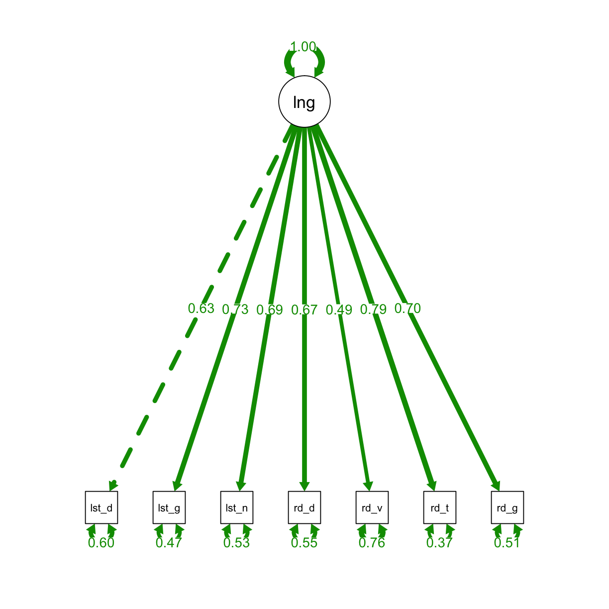
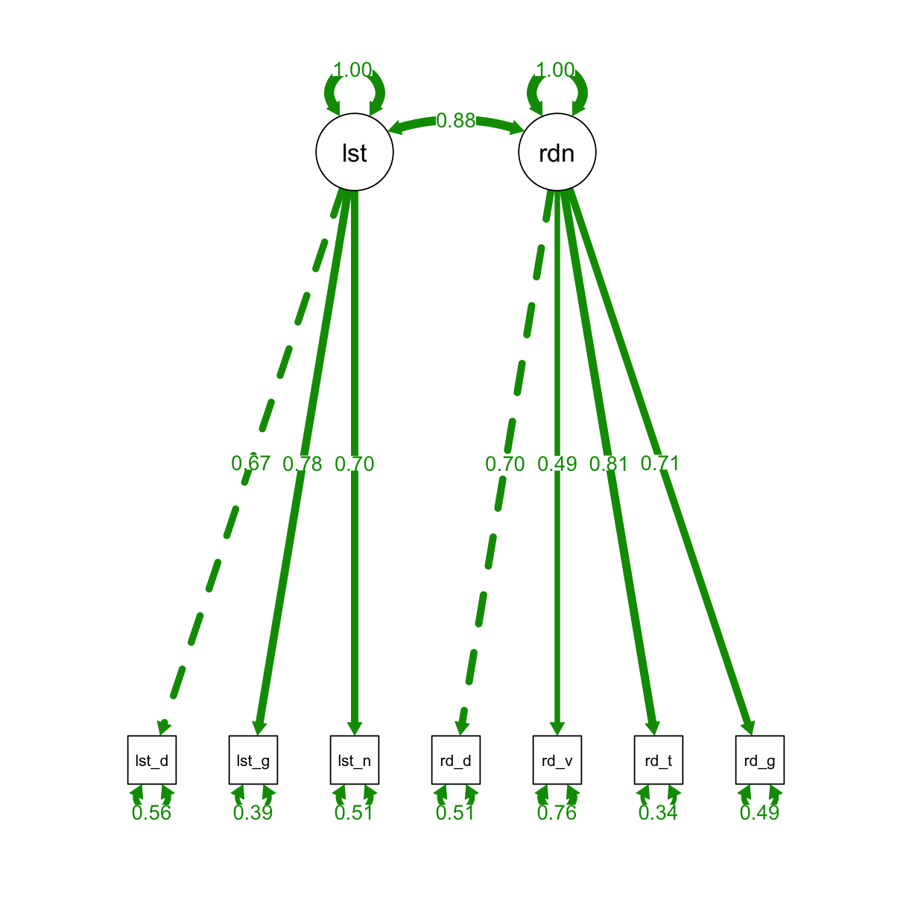
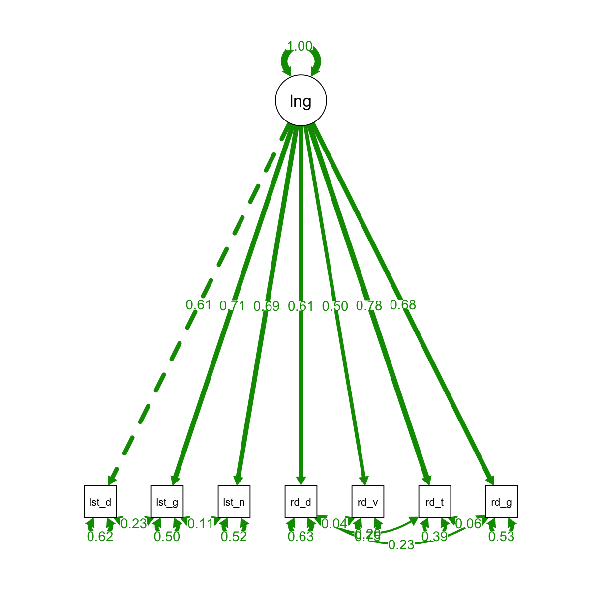

---
# Please do not edit this file directly; it is auto generated.
# Instead, please edit 10-adv.md in _episodes_rmd/
title: "Part 6: Advanced Analyses"
teaching: 60
exercises: 35
questions: 
  - "How can I carry out confirmatory factor analysis?"
  - "How can I compare two models?"
objectives: 
  - "Prepare data for CFA."
  - "Fit a one factor and two-factor model"
  - "Compare the models"
keypoints: 
  - "`lavaan` and `semPlot` are two useful packages for CFA."
source: Rmd
---

In order to carry out CFA on our data, we need to prep it by calculating subscores. Again, we will be using a number of functions from the `tidyverse`.

~~~
#load packages
library(tidyverse)
library(lavaan)
library(semPlot)

# read data
sem_dat <- read_csv("data/placement_2.csv")

# compute subscores
sem_dat <- gather(sem_dat, item, correct, 5:69)
sem_dat <- separate(sem_dat, item, into = c("number", "skill", "type"), 
                    sep = "_", remove = FALSE)

sum_scores <- group_by(sem_dat, ID, skill, type) %>% 
  summarise(total = sum(correct, na.rm = TRUE)) %>%
  unite(skill_type, 2:3, sep = "_") %>%
  spread(skill_type, total)

# some of the subscores are a bit limited in number of questions. combine
sum_scores <- mutate(sum_scores, list_global = list_mi + list_prag,
                        read_global = read_mi + read_inf + read_purp)
~~~
{: .language-r}

We will start by fitting a one-factor confirmatory model.

~~~
# Confirmatory Factor Analyses ----
# 1-factor model
## define the model

one <- '
# latent variable definitions
language =~ list_det + list_global + list_inf + read_det + read_voc +
            read_torg + read_global'

## fit the model
fit_one <- cfa(one, data = sum_scores, missing = "fiml")

## plot the model
semPaths(fit_one, "std", layout = "tree", intercepts = FALSE, residuals = T, nDigits = 2, 
         label.cex = 1, edge.label.cex=.95, fade = FALSE)
~~~
{: .language-r}

We can use `summary` to view the results, and we can check the diagnostics with `resid` and `modindices`.

~~~
#view results
lavaan::summary(fit_one, estimates = TRUE, standardized = TRUE, fit.measures = TRUE)
~~~
{: .language-r}

~~~
lavaan 0.6-3 ended normally after 25 iterations

  Optimization method                           NLMINB
  Number of free parameters                         21

  Number of observations                           173
  Number of missing patterns                         1

  Estimator                                         ML
  Model Fit Test Statistic                      25.751
  Degrees of freedom                                14
  P-value (Chi-square)                           0.028

Model test baseline model:

  Minimum Function Test Statistic              447.156
  Degrees of freedom                                21
  P-value                                        0.000

User model versus baseline model:

  Comparative Fit Index (CFI)                    0.972
  Tucker-Lewis Index (TLI)                       0.959

Loglikelihood and Information Criteria:

  Loglikelihood user model (H0)              -2230.686
  Loglikelihood unrestricted model (H1)      -2217.811

  Number of free parameters                         21
  Akaike (AIC)                                4503.372
  Bayesian (BIC)                              4569.591
  Sample-size adjusted Bayesian (BIC)         4503.094

Root Mean Square Error of Approximation:

  RMSEA                                          0.070
  90 Percent Confidence Interval          0.023  0.111
  P-value RMSEA <= 0.05                          0.201

Standardized Root Mean Square Residual:

  SRMR                                           0.034

Parameter Estimates:

  Information                                 Observed
  Observed information based on                Hessian
  Standard Errors                             Standard

Latent Variables:
                   Estimate  Std.Err  z-value  P(>|z|)   Std.lv  Std.all
  language =~                                                           
    list_det          1.000                               1.206    0.631
    list_global       1.216    0.154    7.893    0.000    1.467    0.728
    list_inf          1.064    0.145    7.360    0.000    1.283    0.687
    read_det          1.038    0.146    7.127    0.000    1.252    0.674
    read_voc          0.458    0.081    5.658    0.000    0.553    0.492
    read_torg         1.523    0.190    8.030    0.000    1.837    0.792
    read_global       1.091    0.148    7.398    0.000    1.316    0.702

Intercepts:
                   Estimate  Std.Err  z-value  P(>|z|)   Std.lv  Std.all
   .list_det          5.029    0.145   34.583    0.000    5.029    2.629
   .list_global       5.237    0.153   34.164    0.000    5.237    2.597
   .list_inf          3.740    0.142   26.341    0.000    3.740    2.003
   .read_det          3.468    0.141   24.555    0.000    3.468    1.867
   .read_voc          1.896    0.085   22.208    0.000    1.896    1.688
   .read_torg         6.058    0.176   34.376    0.000    6.058    2.614
   .read_global       3.214    0.143   22.529    0.000    3.214    1.713
    language          0.000                               0.000    0.000

Variances:
                   Estimate  Std.Err  z-value  P(>|z|)   Std.lv  Std.all
   .list_det          2.203    0.266    8.273    0.000    2.203    0.602
   .list_global       1.913    0.254    7.527    0.000    1.913    0.471
   .list_inf          1.840    0.231    7.968    0.000    1.840    0.528
   .read_det          1.884    0.235    8.027    0.000    1.884    0.546
   .read_voc          0.955    0.108    8.836    0.000    0.955    0.757
   .read_torg         1.999    0.294    6.796    0.000    1.999    0.372
   .read_global       1.788    0.229    7.804    0.000    1.788    0.508
    language          1.455    0.337    4.321    0.000    1.000    1.000
~~~
{: .output}

~~~
#view diagnostics
resid(fit_one, type="standardized")
~~~
{: .language-r}

~~~
$type
[1] "standardized"

$cov
            lst_dt lst_gl lst_nf red_dt red_vc rd_trg rd_glb
list_det     0.000                                          
list_global  1.919  0.000                                   
list_inf    -0.348  1.099  0.000                            
read_det    -1.550 -1.913 -1.161  0.000                     
read_voc     0.952  0.173 -0.684 -0.083  0.000              
read_torg   -1.324  0.222 -0.729  1.139 -0.180  0.000       
read_global -0.562 -3.020  1.036  1.585 -0.137  0.115  0.000

$mean
   list_det list_global    list_inf    read_det    read_voc   read_torg 
          0           0           0           0           0           0 
read_global 
          0 
~~~
{: .output}

~~~
modindices(fit_one)
~~~
{: .language-r}

~~~
           lhs op         rhs    mi    epc sepc.lv sepc.all sepc.nox
24    list_det ~~ list_global 9.509  0.584   0.584    0.284    0.284
25    list_det ~~    list_inf 0.143 -0.068  -0.068   -0.034   -0.034
26    list_det ~~    read_det 2.132 -0.264  -0.264   -0.129   -0.129
27    list_det ~~    read_voc 1.079  0.125   0.125    0.086    0.086
28    list_det ~~   read_torg 1.856 -0.286  -0.286   -0.136   -0.136
29    list_det ~~ read_global 0.287 -0.096  -0.096   -0.048   -0.048
30 list_global ~~    list_inf 2.040  0.257   0.257    0.137    0.137
31 list_global ~~    read_det 3.046 -0.314  -0.314   -0.166   -0.166
32 list_global ~~    read_voc 0.035  0.022   0.022    0.016    0.016
33 list_global ~~   read_torg 0.065  0.055   0.055    0.028    0.028
34 list_global ~~ read_global 8.015 -0.509  -0.509   -0.275   -0.275
35    list_inf ~~    read_det 1.377 -0.200  -0.200   -0.108   -0.108
36    list_inf ~~    read_voc 0.452 -0.076  -0.076   -0.057   -0.057
37    list_inf ~~   read_torg 0.521 -0.146  -0.146   -0.076   -0.076
38    list_inf ~~ read_global 1.453  0.205   0.205    0.113    0.113
39    read_det ~~    read_voc 0.007 -0.010  -0.010   -0.007   -0.007
40    read_det ~~   read_torg 2.855  0.341   0.341    0.175    0.175
41    read_det ~~ read_global 5.295  0.391   0.391    0.213    0.213
42    read_voc ~~   read_torg 0.032 -0.023  -0.023   -0.017   -0.017
43    read_voc ~~ read_global 0.019 -0.015  -0.015   -0.012   -0.012
44   read_torg ~~ read_global 0.022  0.030   0.030    0.016    0.016
~~~
{: .output}

Now we will fit a two-factor model so that we can compare it to the one-factor model. We can use the same commands to examine the model.

~~~
# 2-factor model
## define the model
two <- '
# latent variable definitions
listening =~ list_det + list_global + list_inf
reading =~ read_det + read_voc + read_torg + read_global

#covariances
listening ~~ reading'

##fit the model
fit_two <- cfa(two, data = sum_scores, missing = "fiml")

##plot the model
semPaths(fit_two, "std", layout = "tree", intercepts = FALSE, residuals = TRUE, nDigits = 2, 
         label.cex = 1, edge.label.cex=.95, fade = FALSE)
~~~
{: .language-r}

> ## Exercise
> 
> Explore the model summary and check the diagnostics.
>
> > ## Solution
> >
> > 
> > ~~~
> > #view results
> > lavaan::summary(fit_two, estimates = TRUE, standardized = TRUE, fit.measures = TRUE)
> > 
> > #view diagnostics
> > resid(fit_two, type="standardized")
> > modindices(fit_two)
> > ~~~
> > {: .language-r}
> {: .solution}
{: .challenge}

We can compare models with the `anova` function:

~~~
#compare models

anova(fit_one, fit_two)
~~~
{: .language-r}

~~~
Chi Square Difference Test

        Df    AIC    BIC  Chisq Chisq diff Df diff Pr(>Chisq)   
fit_two 13 4496.3 4565.7 16.672                                 
fit_one 14 4503.4 4569.6 25.751     9.0783       1   0.002587 **
---
Signif. codes:  0 '***' 0.001 '**' 0.01 '*' 0.05 '.' 0.1 ' ' 1
~~~
{: .output}

Now we will fit a model to that controls for method effects:

~~~
one_method <- '
# latent variable definitions
language =~ list_det + list_global + list_inf + read_det + read_voc +
read_torg + read_global

#listening method
list_det ~~ list_global
list_global ~~ list_inf

#reading method
read_det ~~ read_voc
read_det ~~ read_torg
read_det ~~ read_global
read_torg ~~ read_global'

## fit the model
fit_one_method <- cfa(one_method, data = sum_scores, missing = "fiml")

## plot the model
semPaths(fit_one_method, "std", layout = "tree", intercepts = FALSE, residuals = TRUE, nDigits = 2, 
         label.cex = 1, edge.label.cex=.95, fade = FALSE)
~~~
{: .language-r}

~~~
# view results
lavaan::summary(fit_one_method, estimates = TRUE, standardized = TRUE, fit.measures = TRUE)
~~~
{: .language-r}

~~~
lavaan 0.6-3 ended normally after 41 iterations

  Optimization method                           NLMINB
  Number of free parameters                         27

  Number of observations                           173
  Number of missing patterns                         1

  Estimator                                         ML
  Model Fit Test Statistic                       7.629
  Degrees of freedom                                 8
  P-value (Chi-square)                           0.471

Model test baseline model:

  Minimum Function Test Statistic              447.156
  Degrees of freedom                                21
  P-value                                        0.000

User model versus baseline model:

  Comparative Fit Index (CFI)                    1.000
  Tucker-Lewis Index (TLI)                       1.002

Loglikelihood and Information Criteria:

  Loglikelihood user model (H0)              -2221.625
  Loglikelihood unrestricted model (H1)      -2217.811

  Number of free parameters                         27
  Akaike (AIC)                                4497.251
  Bayesian (BIC)                              4582.390
  Sample-size adjusted Bayesian (BIC)         4496.892

Root Mean Square Error of Approximation:

  RMSEA                                          0.000
  90 Percent Confidence Interval          0.000  0.086
  P-value RMSEA <= 0.05                          0.737

Standardized Root Mean Square Residual:

  SRMR                                           0.018

Parameter Estimates:

  Information                                 Observed
  Observed information based on                Hessian
  Standard Errors                             Standard

Latent Variables:
                   Estimate  Std.Err  z-value  P(>|z|)   Std.lv  Std.all
  language =~                                                           
    list_det          1.000                               1.174    0.614
    list_global       1.217    0.154    7.877    0.000    1.429    0.709
    list_inf          1.101    0.162    6.779    0.000    1.293    0.692
    read_det          0.966    0.172    5.627    0.000    1.135    0.611
    read_voc          0.477    0.088    5.437    0.000    0.560    0.499
    read_torg         1.540    0.230    6.693    0.000    1.809    0.780
    read_global       1.091    0.180    6.045    0.000    1.281    0.683

Covariances:
                   Estimate  Std.Err  z-value  P(>|z|)   Std.lv  Std.all
 .list_det ~~                                                           
   .list_global       0.491    0.232    2.114    0.035    0.491    0.228
 .list_global ~~                                                        
   .list_inf          0.202    0.209    0.965    0.335    0.202    0.105
 .read_det ~~                                                           
   .read_voc          0.052    0.115    0.454    0.650    0.052    0.036
   .read_torg         0.430    0.280    1.538    0.124    0.430    0.202
   .read_global       0.458    0.237    1.935    0.053    0.458    0.227
 .read_torg ~~                                                          
   .read_global       0.115    0.280    0.411    0.681    0.115    0.058

Intercepts:
                   Estimate  Std.Err  z-value  P(>|z|)   Std.lv  Std.all
   .list_det          5.029    0.145   34.583    0.000    5.029    2.629
   .list_global       5.237    0.153   34.160    0.000    5.237    2.597
   .list_inf          3.740    0.142   26.341    0.000    3.740    2.003
   .read_det          3.468    0.141   24.554    0.000    3.468    1.867
   .read_voc          1.896    0.085   22.208    0.000    1.896    1.688
   .read_torg         6.058    0.176   34.376    0.000    6.058    2.614
   .read_global       3.214    0.143   22.529    0.000    3.214    1.713
    language          0.000                               0.000    0.000

Variances:
                   Estimate  Std.Err  z-value  P(>|z|)   Std.lv  Std.all
   .list_det          2.279    0.295    7.720    0.000    2.279    0.623
   .list_global       2.025    0.329    6.147    0.000    2.025    0.498
   .list_inf          1.816    0.261    6.964    0.000    1.816    0.521
   .read_det          2.164    0.306    7.075    0.000    2.164    0.627
   .read_voc          0.947    0.110    8.609    0.000    0.947    0.751
   .read_torg         2.101    0.411    5.113    0.000    2.101    0.391
   .read_global       1.879    0.301    6.237    0.000    1.879    0.534
    language          1.379    0.349    3.952    0.000    1.000    1.000
~~~
{: .output}

~~~
# view diagnostics
resid(fit_one_method, type="standardized")
~~~
{: .language-r}

~~~
$type
[1] "standardized"

$cov
            lst_dt lst_gl lst_nf red_dt red_vc rd_trg rd_glb
list_det     0.000                                          
list_global -0.058 -0.016                                   
list_inf    -0.208 -0.133  0.000                            
read_det    -0.126  0.130  0.021 -0.065                     
read_voc     1.079  0.336 -0.992 -0.134  0.000              
read_torg   -0.710  1.322 -0.652 -0.034 -0.173  0.000       
read_global  0.133 -2.101  1.459 -0.003 -0.022  0.000  0.000

$mean
   list_det list_global    list_inf    read_det    read_voc   read_torg 
          0           0           0           0           0           0 
read_global 
          0 
~~~
{: .output}

~~~
modindices(fit_one_method)
~~~
{: .language-r}

~~~
           lhs op         rhs    mi    epc sepc.lv sepc.all sepc.nox
30    list_det ~~    list_inf 0.043 -0.054  -0.054   -0.026   -0.026
31    list_det ~~    read_det 0.023 -0.026  -0.026   -0.012   -0.012
32    list_det ~~    read_voc 1.155  0.129   0.129    0.088    0.088
33    list_det ~~   read_torg 0.862 -0.207  -0.207   -0.095   -0.095
34    list_det ~~ read_global 0.401  0.114   0.114    0.055    0.055
35 list_global ~~    read_det 0.105  0.057   0.057    0.027    0.027
36 list_global ~~    read_voc 0.015  0.015   0.015    0.011    0.011
37 list_global ~~   read_torg 2.708  0.378   0.378    0.183    0.183
38 list_global ~~ read_global 4.857 -0.399  -0.399   -0.204   -0.204
39    list_inf ~~    read_det 0.053 -0.042  -0.042   -0.021   -0.021
40    list_inf ~~    read_voc 0.831 -0.110  -0.110   -0.084   -0.084
41    list_inf ~~   read_torg 0.725 -0.198  -0.198   -0.102   -0.102
42    list_inf ~~ read_global 3.656  0.354   0.354    0.192    0.192
43    read_voc ~~   read_torg 0.029 -0.026  -0.026   -0.019   -0.019
44    read_voc ~~ read_global 0.000 -0.002  -0.002   -0.001   -0.001
~~~
{: .output}

> ## Exercise
> 
> Compare the `one_fit_method` model with the `fit_one` and `fit_two` models.
>
> > ## Solution
> >
> > 
> > ~~~
> > ## compare models
> > anova(fit_one, fit_one_method) #yes, accounting for method effects is important
> > 
> > anova(fit_two, fit_one_method) #inconclusive! 
> > ~~~
> > {: .language-r}
> {: .solution}
{: .challenge}


